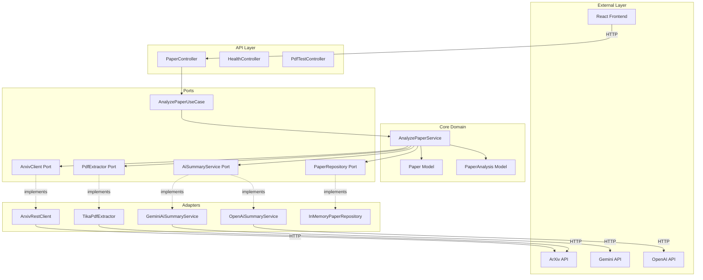

# Research Paper Assistant

An AI-powered Spring Boot application that helps students understand academic research papers by providing intelligent
analysis, summaries, and interactive Q&A for arXiv papers.

## Table of Contents

- [Overview](#overview)
- [Features](#features)
- [Architecture](#architecture)
- [Tech Stack](#tech-stack)
- [Prerequisites](#prerequisites)
- [Quick Start](#quick-start)
- [Configuration](#configuration)
- [API Documentation](#api-documentation)
- [Project Structure](#project-structure)
- [Frontend Integration](#frontend-integration)
- [Development](#development)
- [Future Enhancements](#future-enhancements)

## Overview

Research Paper Assistant is a full-stack application that makes academic research papers more accessible to students
through AI-powered analysis. The system:

- Fetches paper metadata from arXiv
- Extracts text content from PDF documents using Apache Tika
- Generates student-friendly summaries using AI (Gemini or OpenAI)
- Provides interactive Q&A capabilities for deeper understanding
- Estimates difficulty levels and reading time
- Generates citations in multiple formats

The application uses **Hexagonal Architecture** (Ports & Adapters) to ensure clean separation between business logic and
infrastructure, making it maintainable and extensible.

## Features

### Core Capabilities

- **Async Paper Analysis Pipeline**
    - Submit arXiv paper ID for analysis
    - Background processing with job tracking
    - Real-time status updates
    - 30-day caching to minimize API calls

- **AI-Powered Summaries**
    - Student-friendly abstract summaries
    - Comprehensive full-paper summaries
    - Difficulty level estimation (Beginner/Intermediate/Advanced/Expert)
    - Reading time estimates based on content length

- **Interactive Q&A Chatbot**
    - Ask questions about analyzed papers
    - Context-aware responses using paper content
    - Debouncing to prevent spam
    - Real-time chat interface

- **PDF Statistics**
    - Character, word, line, and paragraph counts
    - Estimated page count
    - Extraction metadata
    - Compliant with arXiv terms of service (no raw text display)

- **Citation Generation**
    - APA format
    - MLA format
    - Chicago format
    - BibTeX format

- **Resilience & Performance**
    - Circuit breakers for external API calls
    - Retry mechanisms with exponential backoff
    - Caffeine caching (30-day expiration)
    - Async processing for long-running tasks

## Architecture

The application follows **Hexagonal Architecture** (also known as Ports & Adapters), which separates the core business
logic from external concerns:



### Architecture Benefits

- **Testability**: Core logic can be tested independently of external dependencies
- **Flexibility**: Easy to swap AI providers, storage solutions, or PDF extractors
- **Maintainability**: Clear boundaries between layers
- **Scalability**: Ready for database migration (currently in-memory)

## Tech Stack

### Backend

- **Framework**: Spring Boot 3.5.3
- **Java**: 21
- **Build Tool**: Maven
- **Database**: H2 (dev), PostgreSQL ready
- **PDF Processing**: Apache Tika 2.9.2
- **AI Integration**:
    - Google Gemini API
    - OpenAI GPT-3.5/GPT-4
- **Caching**: Caffeine
- **Resilience**: Resilience4j (Circuit Breaker, Retry)
- **API Documentation**: SpringDoc OpenAPI (Swagger)
- **Validation**: Jakarta Bean Validation
- **Async Processing**: Spring `@Async`

### Frontend

- **Framework**: React 19.1.0
- **Language**: TypeScript 4.9.5
- **Build Tool**: Create React App
- **HTTP Client**: Native Fetch API
- **Styling**: Custom CSS

## Prerequisites

Before running the application, ensure you have:

- **Java 21** or higher
- **Maven 3.6+**
- **Node.js 16+** and npm (for frontend)
- **API Keys**:
    - Google Gemini API key (if using Gemini)
    - OpenAI API key (if using OpenAI)

### Getting API Keys

1. **Gemini API Key**:
    - Visit [Google AI Studio](https://makersuite.google.com/app/apikey)
    - Create a new API key

2. **OpenAI API Key**:
    - Visit [OpenAI Platform](https://platform.openai.com/api-keys)
    - Create a new API key

## Quick Start

### Backend Setup

1. **Clone the repository** (if applicable)

2. **Set environment variables**:
   ```bash
   export GEMINI_API_KEY="your-gemini-api-key"
   export OPENAI_API_KEY="your-openai-api-key"
   ```

3. **Build the project**:
   ```bash
   ./mvnw clean install
   ```

4. **Run the application**:
   ```bash
   ./mvnw spring-boot:run
   ```

5. **Verify the backend is running**:
    - Health check: http://localhost:8080/api/v1/health
    - Swagger UI: http://localhost:8080/swagger-ui.html
    - API Docs: http://localhost:8080/api-docs

### Frontend Setup

1. **Navigate to frontend directory**:
   ```bash
   cd frontend
   ```

2. **Install dependencies**:
   ```bash
   npm install
   ```

3. **Start the development server**:
   ```bash
   npm start
   ```

4. **Access the application**:
    - Frontend: http://localhost:3000
    - Backend: http://localhost:8080

### Verify Installation

Test the setup by checking the health endpoint:

```bash
curl http://localhost:8080/api/v1/health
```

Expected response:

```json
{
  "status": "UP",
  "application": "research-paper-assistant",
  "timestamp": "2024-01-01T12:00:00"
}
```

## Configuration

### Application Configuration

The main configuration file is `src/main/resources/application.yml`:

```yaml
spring:
  application:
    name: research-paper-assistant
  profiles:
    active: dev
  cache:
    type: caffeine
    caffeine:
      spec: maximumSize=100,expireAfterWrite=30d

server:
  port: 8080

app:
  features:
    use-mock-ai: false        # Use mock AI service for testing
    use-mock-arxiv: false     # Use mock arXiv client for testing
    use-gemini-ai: false      # Enable Gemini AI integration
    use-open-ai: true         # Enable OpenAI integration
    enable-caching: true      # Enable caching

  arxiv:
    base-url: https://export.arxiv.org/api/query
    pdf-base-url: https://arxiv.org/pdf/

  gemini:
    api-key: ${GEMINI_API_KEY}
    model: gemini-1.5-flash
    max-tokens: 2048
    temperature: 0.7

  openai:
    api-key: ${OPENAI_API_KEY}
    model: gpt-3.5-turbo
    max-tokens: 2000
    temperature: 0.7
```

### Feature Flags

Control which services are active:

- **`use-mock-ai`**: Use mock AI service (for testing without API keys)
- **`use-mock-arxiv`**: Use mock arXiv client (for offline testing)
- **`use-gemini-ai`**: Enable Google Gemini AI integration
- **`use-open-ai`**: Enable OpenAI integration
- **`enable-caching`**: Enable/disable caching

### Circuit Breaker Configuration

Resilience4j circuit breakers protect against external API failures:

```yaml
resilience4j:
  circuitbreaker:
    instances:
      arxivService:
        failure-rate-threshold: 50
      geminiService:
        failure-rate-threshold: 70
  retry:
    instances:
      arxivRetry:
        max-attempts: 3
        wait-duration: 5s
```

## API Documentation

### Base URL

All endpoints are prefixed with `/api/v1`

### Endpoints

#### Paper Analysis

##### Submit Paper for Analysis

```http
POST /api/v1/papers/analyze
Content-Type: application/json

{
  "arxivId": "1706.03762"
}
```

**Response:**

```json
{
  "jobId": "550e8400-e29b-41d4-a716-446655440000",
  "message": "Paper submitted for analysis",
  "statusUrl": "/api/v1/papers/jobs/550e8400-e29b-41d4-a716-446655440000"
}
```

##### Check Job Status

```http
GET /api/v1/papers/jobs/{jobId}
```

**Response:**

```json
{
  "jobId": "550e8400-e29b-41d4-a716-446655440000",
  "status": "COMPLETED",
  "description": "Analysis completed successfully",
  "progressPercentage": 100
}
```

**Status Values**: `PENDING`, `FETCHING_METADATA`, `EXTRACTING_PDF`, `ANALYZING`, `GENERATING_SUMMARY`,
`FORMATTING_CITATIONS`, `COMPLETED`, `FAILED`

##### Get Analysis Results

```http
GET /api/v1/papers/{arxivId}
```

**Response:**

```json
{
  "arxivId": "1706.03762",
  "title": "Attention Is All You Need",
  "authors": "Ashish Vaswani, Noam Shazeer, ...",
  "abstractText": "The dominant sequence transduction models...",
  "abstractSummary": "**Student-Friendly Summary**\n\nThis research paper introduces...",
  "fullTextSummary": "**Comprehensive Paper Summary**\n\n**1. Main Idea:**\nThe paper introduces...",
  "difficulty": {
    "level": "ADVANCED",
    "description": "Requires significant expertise",
    "emoji": "🎓"
  },
  "estimatedReadingTimeMinutes": 45,
  "citations": {
    "apa": "Vaswani, A., et al. (2017). Attention Is All You Need...",
    "mla": "Vaswani, Ashish, et al. \"Attention Is All You Need.\"...",
    "chicago": "Vaswani, Ashish, et al. \"Attention Is All You Need.\"...",
    "bibtex": "@article{vaswani2017attention,..."
  },
  "publishedDate": "2017-06-12T00:00:00",
  "analyzedAt": "2024-01-01T12:00:00"
}
```

#### Q&A Chatbot

##### Ask Question About Paper

```http
POST /api/v1/papers/{arxivId}/ask
Content-Type: application/json

{
  "question": "What is the main contribution of this paper?"
}
```

**Response:**

```json
{
  "questionId": "660e8400-e29b-41d4-a716-446655440001",
  "arxivId": "1706.03762",
  "question": "What is the main contribution of this paper?",
  "answer": "The main contribution of this paper is the introduction of the Transformer architecture...",
  "timestamp": "2024-01-01T12:05:00"
}
```

#### PDF Statistics

##### Get PDF Statistics (Test Endpoint)

```http
GET /api/v1/test/pdf/extract-stats/{arxivId}
```

**Response:**

```json
{
  "success": true,
  "arxivId": "1706.03762",
  "title": "Attention Is All You Need",
  "statistics": {
    "totalCharacters": 125000,
    "totalWords": 20000,
    "totalLines": 1500,
    "totalParagraphs": 200,
    "estimatedPages": 80
  },
  "extractedAt": "2024-01-01T12:00:00"
}
```

#### Health Check

##### Check Service Health

```http
GET /api/v1/health
```

**Response:**

```json
{
  "status": "UP",
  "application": "research-paper-assistant",
  "timestamp": "2024-01-01T12:00:00"
}
```

#### Circuit Breaker Status

##### Get Circuit Breaker Metrics

```http
GET /api/v1/circuitbreaker
```

**Response:**

```json
{
  "arxivService": {
    "state": "CLOSED",
    "failureRate": 0.0,
    "numberOfSuccessfulCalls": 100,
    "numberOfFailedCalls": 0
  },
  "geminiService": {
    "state": "CLOSED",
    "failureRate": 5.0,
    "numberOfSuccessfulCalls": 95,
    "numberOfFailedCalls": 5
  }
}
```

### Example Requests

#### Using cURL

**Submit paper for analysis:**

```bash
curl -X POST http://localhost:8080/api/v1/papers/analyze \
  -H "Content-Type: application/json" \
  -d '{"arxivId": "1706.03762"}'
```

**Check job status:**

```bash
curl http://localhost:8080/api/v1/papers/jobs/{jobId}
```

**Get analysis results:**

```bash
curl http://localhost:8080/api/v1/papers/1706.03762
```

**Ask a question:**

```bash
curl -X POST http://localhost:8080/api/v1/papers/1706.03762/ask \
  -H "Content-Type: application/json" \
  -d '{"question": "What is the Transformer architecture?"}'
```

**Get PDF statistics:**

```bash
curl http://localhost:8080/api/v1/test/pdf/extract-stats/1706.03762
```

### Example arXiv IDs for Testing

- `1706.03762` - Attention Is All You Need (Transformer)
- `1810.04805` - BERT: Pre-training of Deep Bidirectional Transformers
- `1512.03385` - ResNet: Deep Residual Learning for Image Recognition
- `1406.2661` - Generative Adversarial Networks
- `2005.14165` - GPT-3: Language Models are Few-Shot Learners

## Project Structure

```
researchpaperassistant/
├── src/
│   ├── main/
│   │   ├── java/com/sasmit/researchpaperassistant/
│   │   │   ├── api/
│   │   │   │   ├── dto/
│   │   │   │   │   ├── request/          # Request DTOs
│   │   │   │   │   └── response/         # Response DTOs
│   │   │   │   └── v1/
│   │   │   │       └── controllers/      # REST Controllers
│   │   │   ├── core/
│   │   │   │   ├── domain/
│   │   │   │   │   └── model/            # Domain models (Paper, PaperAnalysis)
│   │   │   │   ├── ports/
│   │   │   │   │   ├── in/               # Input ports (Use Cases)
│   │   │   │   │   └── out/              # Output ports (Interfaces)
│   │   │   │   └── usecases/             # Business logic implementations
│   │   │   ├── infrastructure/
│   │   │   │   ├── adapters/
│   │   │   │   │   ├── arxiv/            # ArXiv API adapters
│   │   │   │   │   ├── gemini/           # Gemini AI adapter
│   │   │   │   │   ├── openai/           # OpenAI adapter
│   │   │   │   │   ├── pdf/              # PDF extraction adapter
│   │   │   │   │   └── persistence/      # Repository implementations
│   │   │   │   └── config/               # Configuration classes
│   │   │   ├── shared/                   # Shared utilities
│   │   │   └── ResearchpaperassistantApplication.java
│   │   └── resources/
│   │       └── application.yml           # Application configuration
│   └── test/                             # Test files
├── frontend/                             # React frontend
│   ├── src/
│   │   ├── components/                   # React components
│   │   ├── App.tsx                       # Main app component
│   │   └── index.tsx                     # Entry point
│   └── package.json
├── pom.xml                               # Maven configuration
└── README.md                             # This file
```

### Key Components

- **Controllers**: Handle HTTP requests and responses
- **Use Cases**: Core business logic (AnalyzePaperService)
- **Ports**: Interfaces defining contracts (in/out ports)
- **Adapters**: Implementations of ports (API clients, repositories)
- **Domain Models**: Core business entities (Paper, PaperAnalysis)
- **DTOs**: Data Transfer Objects for API communication

## Frontend Integration

The React frontend provides a user-friendly interface for interacting with the API.

### Features

- **Three Analysis Modes**:
    - Full Analysis (AI Summary)
    - PDF Statistics Only
    - Chatbot Mode

- **User Experience**:
    - Real-time loading states
    - Error handling and display
    - Responsive design
    - Debounced chatbot to prevent spam

### Running the Frontend

```bash
cd frontend
npm install
npm start
```

The frontend will run on `http://localhost:3000` and automatically connect to the backend at `http://localhost:8080`.

### Frontend Components

- **PaperForm**: Input form for arXiv IDs
- **PaperAnalysis**: Display analysis results
- **Chatbot**: Interactive Q&A interface
- **LoadingSpinner**: Loading state indicator
- **ErrorMessage**: Error display component

## Development

### Running in Development Mode

**Backend:**

```bash
./mvnw spring-boot:run
```

**Frontend:**

```bash
cd frontend && npm start
```

### Building for Production

**Backend:**

```bash
./mvnw clean package
java -jar target/researchpaperassistant-0.0.1-SNAPSHOT.jar
```

**Frontend:**

```bash
cd frontend
npm run build
# Static files will be in frontend/build/
```

### Testing

**Backend Tests:**

```bash
./mvnw test
```

**Frontend Tests:**

```bash
cd frontend && npm test
```

### Accessing Swagger UI

Once the backend is running, access interactive API documentation at:

- Swagger UI: http://localhost:8080/swagger-ui.html
- OpenAPI JSON: http://localhost:8080/api-docs

### H2 Console (Development)

Access the in-memory H2 database console at:

- URL: http://localhost:8080/h2-console
- JDBC URL: `jdbc:h2:mem:testdb`
- Username: `sa`
- Password: (empty)

## Future Enhancements

### Planned Features

1. **Paper Recommendations**
    - Suggest similar papers based on content
    - Topic-based recommendations
    - Citation network analysis

2. **User Management**
    - User authentication and authorization
    - Personal API key management
    - Usage tracking and limits

3. **Enhanced Storage**
    - PostgreSQL database migration
    - Persistent storage for papers and analyses
    - User history and favorites

4. **Batch Processing**
    - Analyze multiple papers at once
    - Bulk import/export
    - Scheduled analysis jobs

5. **Advanced Analytics**
    - Paper difficulty trends
    - Reading time analytics
    - Popular topics and papers

6. **Export Features**
    - Export summaries to PDF
    - Export citations to BibTeX file
    - Share analysis results

7. **Enhanced Chatbot**
    - Conversation history
    - Context-aware follow-up questions
    - Paper comparison capabilities

8. **Performance Improvements**
    - Redis caching layer
    - Message queue for async processing
    - Horizontal scaling support

9. **Additional AI Providers**
    - Support for more AI models
    - Provider fallback mechanisms
    - Cost optimization strategies

10. **Compliance & Security**
    - Rate limiting per user
    - API key rotation
    - GDPR compliance features
    - Enhanced CORS configuration

## Contributing

This is currently a personal project, but contributions and suggestions are welcome!

## Acknowledgments

- ArXiv for providing access to research papers
- Google Gemini and OpenAI for AI capabilities
- Apache Tika for PDF processing
- Spring Boot community for excellent documentation


